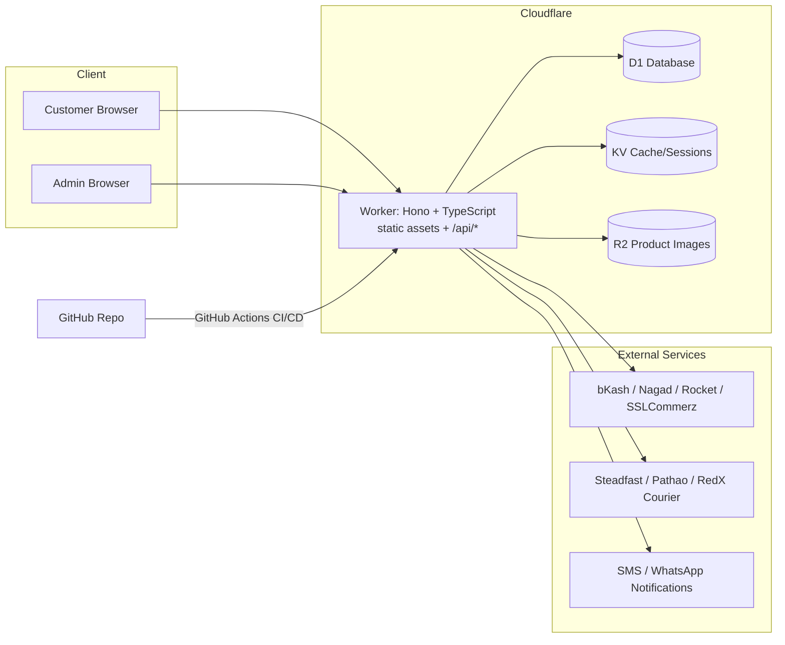

# Lk's Attire — Full-Stack E-Commerce Website & Admin Dashboard (A–Z Build Prompt)

Create a comprehensive, detailed, end-to-end (A–Z) plan and specification — and, where possible, a working implementation — for a full-stack e-commerce website with a fully-featured admin dashboard, for:

- **Brand name:** Lk's Attire
- **Business type:** Women's clothing & fashion retail (sarees, three-piece/salwar kameez, kurtis, western wear, abayas/hijabs, festive & ethnic wear, accessories)
- **Location:** Tangail, Akurtakur Para, Bangladesh
- **Primary market:** Bangladesh, mobile-first, Bangla + English speaking customers

The system must be built on **Cloudflare** for hosting/runtime (Workers, D1, KV, R2), with source code hosted on **GitHub** and deployed via GitHub Actions — i.e. one Cloudflare Worker (Hono + TypeScript) serves both the static storefront/admin app and all `/api/*` routes, GitHub is the source of truth and CI/CD pipeline, and Cloudflare is the runtime target. The admin dashboard must support full CRUD (Create, Read, Update, Delete) for every resource listed below, with proper validation, confirmation prompts, and success/failure feedback.

The deliverable must include the following:

## 1. Brand, Market & Business Requirements
- Define the brand identity: the name "Lk's Attire", a short tagline, a logo concept direction, and a customer-facing color palette suited to a women's fashion brand (propose 2–3 options, e.g. blush-pink/rose-gold/ivory for everyday elegance, or deep maroon/gold for a festive positioning).
- Define the target customer profile: age range, style preferences, price sensitivity, and shopping habits typical of Bangladeshi women shoppers.
- Specify that **all customer-facing and admin UI text must be bilingual (Bangla + English) with a language toggle**, written in plain, non-technical language throughout.
- Specify the business model: Cash on Delivery (COD) as the default payment method, with mobile financial services (bKash, Nagad, Rocket) and card payment as additional options.
- Feature the shop's physical location — **Tangail, Akurtakur Para** — on the Contact/About page, the site footer, and in structured data, including a placeholder map embed, for local SEO and customer trust.
- Note that the store will be run day-to-day by a small, non-technical team, so every admin workflow must be operable with no coding knowledge, using large touch targets and clear, plain-language labels and confirmation messages.

## 2. Public Website — Description & Layout
- Modern, mobile-first, minimalist design. Recommend a color scheme (e.g. a soft pink/rose-gold gradient with white and charcoal text) consistent with the brand palette from Section 1.
- Site map: Home, Shop (category & subcategory listing), Product Detail, Cart, Checkout, Account (Login/Register, Order History, Wishlist, Saved Addresses), About/Contact, Search Results, optional Blog/Lookbook.
- **Homepage:** hero banner/slider, category tiles, new arrivals, best sellers, a seasonal/festive collection banner (Eid, Puja, wedding season), customer testimonials/reviews, an Instagram feed embed, a newsletter/WhatsApp signup block, and a footer with location, social links, and policies (returns, delivery, privacy).
- **Product listing page:** filters (category, size, color, price range, availability, fabric), sorting (price, newest, popularity, discount), a grid/list toggle, and pagination or infinite scroll.
- **Product detail page:** a multi-image gallery with zoom, a size & color variant selector with live stock status, price with discount/strikethrough, a size-guide modal, quantity selector, Add to Cart / Buy Now, product description, fabric/care info, customer reviews & ratings, related/upsell products, social-share buttons, and a "WhatsApp us about this product" button.
- **Cart & checkout:** guest checkout allowed; a Bangladesh address form (Division → District → Upazila → area) with live delivery-fee calculation tiered by zone (e.g. inside Tangail town / outside Tangail / Dhaka / rest of Bangladesh); payment-method selection (COD, bKash, Nagad, Rocket, card via a gateway such as SSLCommerz); an order summary; an order-confirmation page; and automated SMS/WhatsApp/email order confirmation.
- **Account area:** order history with live status tracking, wishlist, saved addresses, an editable profile, and password reset.
- Performance requirement: the site must load acceptably on a mid-range Android phone over a slower mobile connection, since that's the dominant device/network profile for the target market.

## 3. Admin Dashboard — Description & Layout
- **Visual style (default):** modern, minimalist Soft UI (Neumorphism) with a **purple, white and pink gradient** color scheme, rounded corners, and soft shadows — feminine and premium, fitting an attire brand.
- **Three-pane layout:**
  - **Left sidebar** (collapsible, purple background, rounded outer edge): icon navigation for Dashboard, Orders, Products, Reports, and Settings, plus an expanded text menu covering Product Management, Category Management, Order Management, Customer Management, Coupon & Discount Management, Inventory & Stock, Banner/Homepage Content, Reviews Moderation, Staff & Roles, Reports/Analytics, System Settings, and Help Center.
  - **Center panel:** a dashboard home with a monthly sales line chart, KPI cards (today's orders, revenue, pending COD confirmations, low-stock alerts, new customers) each with a progress indicator and its own accent color, a recent-orders table, and a top-selling-products widget.
  - **Right sidebar:** a search bar, an admin profile menu (Profile Settings, Sign Out), a notification bell (new order, low stock, new review), and a staff/online-status panel if multiple admins are active at once.
- **CRUD modules** — specify exact fields, list-view columns, filters, and validation rules for each:
  - **Products** — name, bilingual description, category, price, discount, sizes, colors, per-variant stock, multiple images, tags, status, SEO slug — plus bulk CSV import/export and bulk stock updates.
  - **Categories & Subcategories** — nested (e.g. Saree → Cotton Saree), drag-to-reorder.
  - **Orders** — line items, customer, address, payment method/status, and a delivery-status pipeline (Pending → Confirmed → Packed → Shipped [with courier + tracking ID] → Delivered → Returned/Cancelled), with printable invoices/shipping labels and refund handling.
  - **Customers** — profile, order history, block/unblock, internal notes.
  - **Coupons/Discounts** — percentage or flat, minimum order value, expiry date, usage limits, per-category rules.
  - **Homepage/Banner management** — hero-slider images, promo banners, festive-campaign scheduling.
  - **Reviews** — approve/reject/reply, flag inappropriate content.
  - **Inventory** — stock levels, low-stock threshold alerts, a stock-adjustment log.
  - **Staff & Roles** — Super Admin, Manager, Order Processor, Read-only Viewer, each with a permission matrix.
  - **Reports/Analytics** — sales by date range/category/product, best customers, delivery-partner performance, CSV export.
  - **System Settings** — store info, delivery zones & rates, payment-gateway keys, SMS/notification templates, SEO defaults.
  - **Activity/Audit Log** — who changed what and when.
- **CRUD interaction requirements:** create/edit via a modal or slide-over panel; inline field validation with clear bilingual error messages; a confirmation dialog before any delete (with soft-delete/"trash" recovery where practical); toast notifications for success and failure; role-based hiding of actions a staff member isn't permitted to perform; and search, filter, and pagination on every list view.

## 4. Full-Stack Architecture
- Describe a single-Worker architecture: one Cloudflare Worker (Hono + TypeScript) serves both the static storefront/admin assets and all `/api/*` routes, backed by D1 (relational data), KV (sessions/cache), and R2 (product images, via a direct binding or a signed-URL pattern if the bucket ends up cross-account).
- Explain explicitly why this satisfies both "GitHub" and "Cloudflare": the **GitHub repository is the source of truth and CI/CD pipeline** (GitHub Actions deploys automatically on push to `main`), while **Cloudflare Workers is the runtime that actually serves the site** — there's no need to choose between GitHub Pages and Cloudflare as separate hosts.
- Provide a system architecture diagram in Mermaid syntax. At minimum it should show customer/admin browsers hitting the Worker, the Worker talking to D1/KV/R2 and to external payment, courier, and notification services, and the GitHub → GitHub Actions → Cloudflare deploy path — expand and refine a starting shape like:



## 5. Data Models
- Provide schema tables (columns, types, keys, relationships) for at least: `products`, `product_variants`, `categories`, `orders`, `order_items`, `customers`, `addresses`, `reviews`, `coupons`, `admins` (with roles), `inventory_log`, and `delivery_zones`.
- Include Bangladesh-specific address fields (Division, District, Upazila, area/village, delivery-fee tier).
- Include one fully worked example — an **Order** model as a TypeScript interface (matching the Hono/TypeScript backend, not a Microsoft-stack language), such as:

```typescript
interface Order {
  id: string;
  customer: {
    name: string;
    phone: string;
    address: { division: string; district: string; upazila: string; area: string };
  };
  items: Array<{
    productId: string;
    variant: { size: string; color: string };
    quantity: number;
    unitPrice: number;
  }>;
  deliveryFee: number;
  paymentMethod: "COD" | "bKash" | "Nagad" | "Rocket" | "Card";
  paymentStatus: "pending" | "paid" | "failed";
  orderStatus: "pending" | "confirmed" | "packed" | "shipped" | "delivered" | "returned" | "cancelled";
  courier?: { partner: "Steadfast" | "Pathao" | "RedX"; trackingId?: string };
  createdAt: string;
}
```

## 6. Payments, Delivery & Third-Party Integrations
- **Payments:** Cash on Delivery, bKash, Nagad, and Rocket, plus card payments via a gateway such as SSLCommerz (or a similar local aggregator) — describe the integration flow and webhook/callback handling for each.
- **Delivery:** Steadfast as the primary courier partner, with Pathao Courier and RedX as alternatives — cover tracking-ID sync and delivery-status webhooks.
- **Delivery-fee logic:** live fee calculation at checkout based on the selected Division/District/Upazila, tiered by zone.
- **Notifications:** SMS and/or WhatsApp order-confirmation and status-update messages.
- **Optional:** social login (Google/Facebook); Google Analytics 4, Meta Pixel, and Cloudflare Web Analytics; and, as an advanced/later feature, Cloudflare Workers AI for auto-generated bilingual product descriptions, a simple "you may also like" recommendation widget, or a support chatbot trained on the store's delivery/return/sizing policies.

## 7. Security & Compliance
Align the security posture with the **NIST Cybersecurity Framework** (Govern, Identify, Protect, Detect, Respond, Recover), scoped for a retail e-commerce site handling customer PII and payment redirects:
- **Govern:** designate who is responsible for security decisions, data-access approvals, and vendor (payment/courier) risk — even if that's just the owner plus one trusted staff member.
- **Identify:** inventory the data assets in play (customer PII, order data, payment references) and map how data flows between the storefront, the Worker, and third-party services.
- **Protect:** hash passwords (bcrypt/Argon2 or a Workers-compatible equivalent), enforce HTTPS/HSTS, apply role-based access control to every admin action, keep secrets (API keys) in Wrangler secrets rather than in code, and minimize PCI scope by using hosted/redirect payment flows instead of handling raw card data.
- **Detect:** log admin actions, rate-limit and add basic bot protection to auth and checkout endpoints, and alert on repeated failed logins.
- **Respond:** document an incident-response outline — revoke keys, notify affected customers, restore from backup.
- **Recover:** define a D1 backup/export strategy and a documented restore procedure.

## 8. Testing Strategy
- Unit and integration tests for Worker routes using Vitest with Miniflare (or `@cloudflare/vitest-pool-workers`).
- End-to-end tests for the critical checkout flow (browse → cart → checkout → COD/payment → confirmation) using Playwright.
- Example JSON request/response fixtures for at least the product-list, create-order, and admin-login endpoints.
- Require a TypeScript build check as part of CI before any deploy.

## 9. Dashboard Development Plan
- Choose components/libraries appropriate to a lightweight, low-build-tooling stack (vanilla JS/HTML/CSS, or a light library such as Alpine.js/htmx), plus a small charting library (e.g. Chart.js) for the sales/analytics views.
- The admin dashboard must be fully usable on a tablet or large phone, since staff may manage orders on mobile.
- Define loading, empty, and error states for every data view.

## 10. File & Folder Structure
Provide a directory tree covering the storefront, admin app, Worker/API code, D1 migrations, tests, and CI config — for example:
```
lks-attire/
├── worker/
│   ├── src/
│   │   ├── routes/          (api routes: products, orders, customers, auth, admin)
│   │   ├── lib/              (payment, courier, sms integrations)
│   │   └── index.ts
│   ├── migrations/
│   └── wrangler.toml
├── public/                   (storefront static assets)
├── admin/                    (admin dashboard static assets)
├── tests/
├── .github/workflows/
└── docs/
```
Adjust and expand this to fit the final chosen structure.

## 11. Development Environment & Deployment Setup
- Step-by-step setup: required Node.js version, installing and logging into the `wrangler` CLI, `wrangler d1 create`, `wrangler kv namespace create`, R2 bucket creation, a sample `wrangler.toml`, and a sample `.dev.vars` for local secrets.
- GitHub repository setup and branch strategy (e.g. `main` = production, feature branches merged via pull request).
- A GitHub Actions workflow (YAML) that runs tests, builds, applies D1 migrations, and deploys the Worker on every push to `main`.
- Custom domain setup (e.g. `lksattire.com`) via Cloudflare DNS.

## 12. SEO, Performance & Marketing
- Meta tags, Open Graph/Twitter cards, `sitemap.xml`, and `robots.txt`.
- JSON-LD structured data: `Product` schema for listings and `ClothingStore`/`LocalBusiness` schema for the Tangail, Akurtakur Para location, for local search visibility.
- Core Web Vitals/performance targets for mobile.
- A WhatsApp click-to-chat button and a Facebook/Instagram Shop feed integration.

## 13. Suggested Product Categories & Content Plan
Propose an initial category taxonomy — e.g. Saree, Three-Piece/Salwar Kameez, Kurti/Tunic, Western Wear, Abaya & Hijab, Festive/Wedding Collection, Kids' Wear (optional), Accessories, Footwear — and flag these as adjustable starting points rather than fixed.

## 14. Phased Roadmap
- **Phase 1 (MVP):** catalog browsing, cart, COD checkout, order confirmation, and basic admin CRUD for products, orders, and categories.
- **Phase 2:** bKash/Nagad/SSLCommerz payment integration, Steadfast courier API integration, coupons, customer reviews, reports/analytics.
- **Phase 3:** AI-assisted product descriptions/chatbot, wishlist, a loyalty/rewards program, and an installable PWA with offline support.

## 15. Development & Delivery Conventions
When generating code (not just a plan), follow these conventions:
- Always output complete, untruncated files — never partial diffs.
- Validate with a TypeScript/build check before presenting code as finished.
- Keep every piece of admin and customer-facing copy bilingual (Bangla + English) and in plain language, with large touch targets throughout.
- Start from a clean checkout of the repository before editing any existing code.

## 16. Acceptance Checklist
Before considering this complete, confirm:
- [ ] Storefront and admin dashboard are both fully bilingual (Bangla/English) with a working language toggle
- [ ] A customer can browse, filter, add to cart, and check out as a guest, with Division/District/Upazila address fields and live delivery-fee calculation
- [ ] COD checkout works end-to-end; at least one mobile financial service (bKash or Nagad) is integrated or clearly stubbed for later activation
- [ ] Admin can fully create, read, update, and delete products (with variants), categories, orders, customers, coupons, and homepage banners
- [ ] The order-status pipeline updates correctly and triggers a customer notification at each stage
- [ ] The admin dashboard is usable on a tablet/large phone with no horizontal scrolling
- [ ] The site loads acceptably on a mid-range Android phone over 3G/4G
- [ ] Basic SEO is in place (meta tags, sitemap, structured data with the Tangail/Akurtakur Para address)
- [ ] No secrets (payment/courier API keys) are committed to the repository

## Output Format
Deliver the response as a single structured document with:
- Clear, labeled sections matching the numbering above.
- Diagrams in Mermaid syntax where applicable.
- Tables for every data model, with column names, types, and relationships.
- Code snippets and JSON examples embedded contextually, in TypeScript (not C# or any Microsoft-stack technology).
- The file/folder structure shown as an indented directory tree.
- A short glossary translating any Bangla UI terms used, for stakeholders unfamiliar with Bangla.

Ensure the result is precise and complete enough to serve as the definitive build guide for a small, non-technical team overseeing developers building **Lk's Attire** on Cloudflare, with source hosted on GitHub.

## Notes
- Treat Cash on Delivery plus mobile financial services (bKash/Nagad) as the primary payment reality for this market; card payments are secondary.
- Bilingual (Bangla/English) support and a non-technical-friendly admin UI are hard requirements, not nice-to-haves.
- Flag any assumption made (exact color palette, exact delivery-fee tiers, exact category list) as adjustable, and confirm it with the requester before finalizing.
